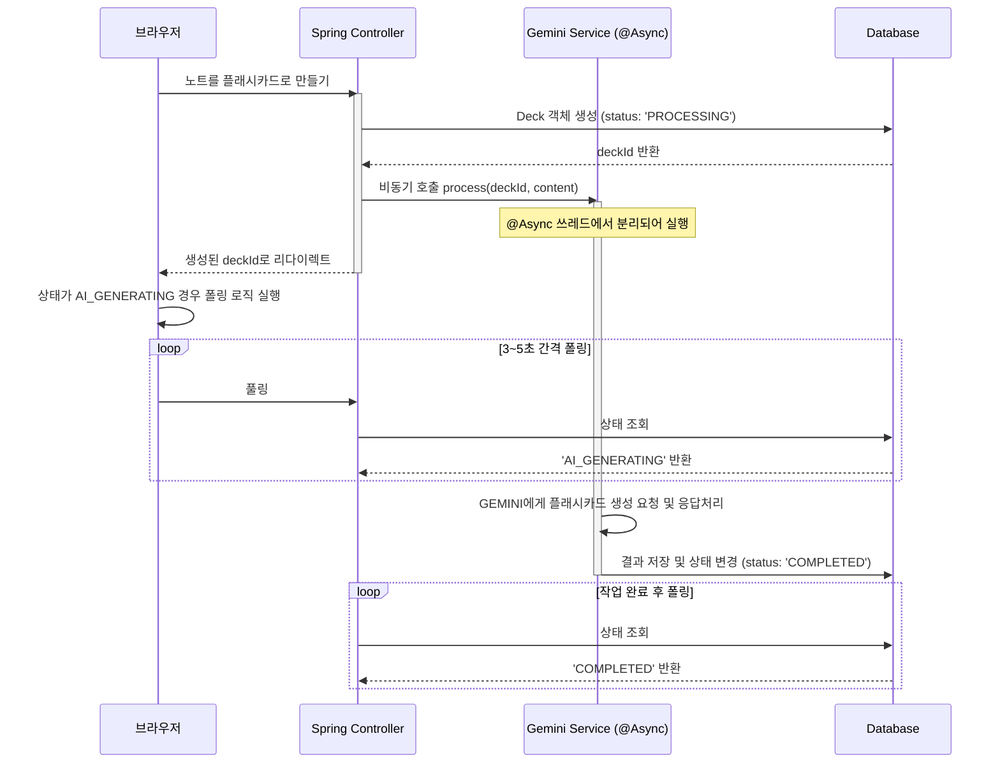

# ⚡ Flash Note
배포 : [flashnote.rejs.link](flashnote.rejs.link)

## 프로젝트 개요 
- 필기를 넘어 기억으로
- FSRS 간격 반복 알고리즘 기반 학습 
- 필기한 내용을 AI를 사용하여 복습 카드로 만들어주는 기능 

## 주요기능
- toastUI 기반 마크다운 스타일 노트 작성 및 수정 
- meilisearch 기반 full text search 지원 
- ai 플래시 카드 생성 : 작성한 필기내용을 gemini를 통해 요약 후 학습카드로 추출 
- 생성된 또는 제작한 학습카드를 FSRS 알고리즘으로 최적의 복습 스케줄 제공

## 기술 스택 (Tech Stack)

### Backend
* **Java 21**, **Spring Boot 3.5.9** **JSP**
* **JPA (Hibernate)**, **QueryDSL 5.1.0**
* **Google GenAI (Gemini) SDK**
* **Fixture Monkey** (테스트 객체 생성)
* **MariaDB** (Main DB)
* **Meilisearch** (Search Engine)
* **Docker & Docker Compose**

## 트러블 슈팅
### 검색 API 성능 문제
테스트 데이터 : 평균 60kb의 생성 텍스트 1만개를 삽입 후 검색실행  

#### 1. 문제 상황: RDBMS `LIKE` 쿼리의 한계
초기에는 MariaDB의 `LIKE %keyword%` 쿼리를 사용하여 검색을 구현
동시 접속 부하 테스트(VUs 166) 시 심각한 성능 저하 발생.
* **평균 응답 속도(Avg Latency)**: 31.8s (Timeout 발생)
* **요청 실패율(Error Rate)**: 98% (대부분의 요청이 실패)
* **원인**: 인덱스를 타지 못하는 검색 쿼리로 인한 DB 부하

#### 2.  Meilisearch 검색 엔진 도입
Meilisearch도입 

* **결과**:
    * 평균 응답 속도: **31.8s → 1.2s** 
    * 요청 실패율: **0%** (안정성 확보)
응답 속도가 1초 대로 개선되었으나, 여전히 느림 

#### 3. 응답 데이터(Payload) 최적화
프로파일링 결과, 검색된 노트의 **본문(Content, 약 60KB)** 까지 모두 전송하고 있어 병목 발생
검색 목록 조회 시에는 본문을 제외하고 필수 데이터만 전송하도록 개선 

- 한계 : 100 rps 상황에서 p95 latency가 500ms가 넘어감
  - 그 이유는 검색엔진 및 spring web server가 동일한 t3.medium(2vcpu, 4gb memory)를 사용하기 때문에 발생하는 하드웨어적인 한계로 추정
  - cpu 사용량 70~85% 포화
  - run queue size : 최대 26개
  - load average (1m) : 6.62 

|아키텍처 및 개선 사항               | RPS | Avg Latency | P95 Latency | 
|:---------------------------| :---: | :---: | :---: |
| MariaDB (`LIKE %keyword%`) | 1.4 | 31,897 ms | 42,928 ms | 
| Meilisearch 도입             | 18.9 | 1,268 ms | 3,081 ms |
| **Payload 최적화 (저부하)**      | **40.0** | **60.7 ms** | **106.1 ms** | 
| **Payload 최적화 (고부하)**      | **99.3** | **171.1 ms** | **514.9 ms** |


## 시스템 아키텍처 (Architecture)
### AI 플래시카드 생성 프로세스


````mermaid
stateDiagram-v2
    [*] --> AI_GENERATING : 1. AI 루트 (AI에 의해 생성 중)
    [*] --> COMPLETED : 2. 수동 루트 (즉시 생성 완료)

    AI_GENERATING --> COMPLETED : AI 작업 성공
    AI_GENERATING --> AI_GEN_FAILED : AI 생성 실패

    AI_GEN_FAILED --> AI_GENERATING : 재시도 시
    COMPLETED --> [*] : 사용자에게 노출```
````
