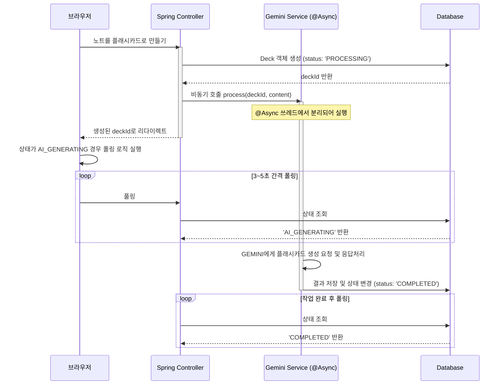

````mermaid
stateDiagram-v2
    [*] --> AI_GENERATING : 1. AI 루트 (AI에 의해 생성 중)
    [*] --> COMPLETED : 2. 수동 루트 (즉시 생성 완료)

    AI_GENERATING --> COMPLETED : AI 작업 성공
    AI_GENERATING --> AI_GEN_FAILED : AI 생성 실패

    AI_GEN_FAILED --> AI_GENERATING : 재시도 시
    COMPLETED --> [*] : 사용자에게 노출```
````
